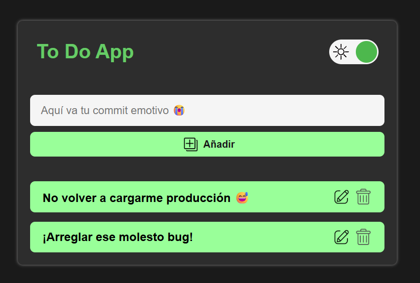

# 📝 Lista de Tareas - To Do App

Una aplicación simple de lista de tareas para ayudarte a organizar tu día de manera fácil y rápida.

## 🚀 Funcionalidades

- Añadir nuevas tareas.
- Editar tareas.
- Eliminar tareas.
- Interfaz amigable y responsiva.

## 📸 Vista previa

## 🛠️ Tecnologías utilizadas

- HTML5
- Tailwindcss
- JavaScript

## Clona el repositorio:
[Clonar Repositorio](https://github.com/Misterreme/Todo-App.git)

## Github Pages
[To do App](https://misterreme.github.io/Todo-App/)